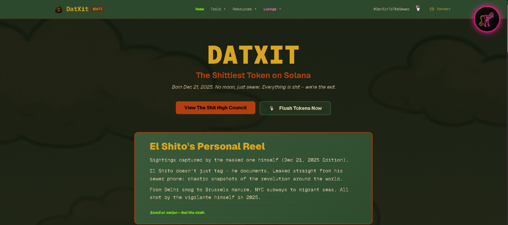
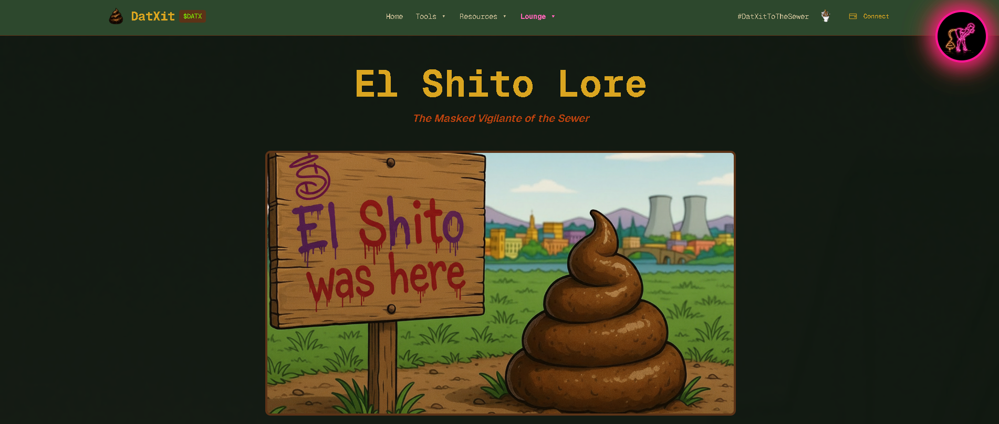
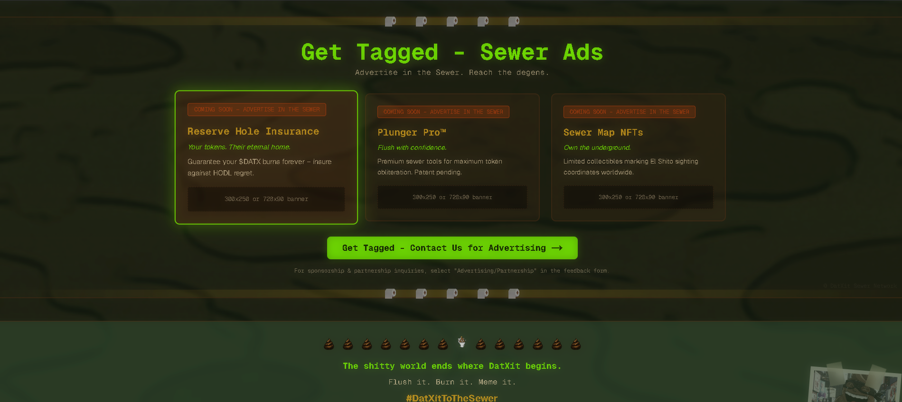
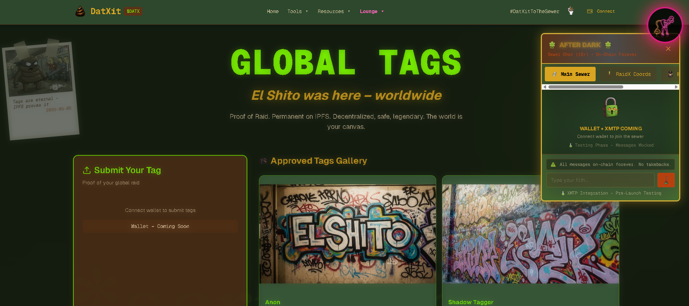

<div align="center">

# Omnichain Memecoin Gaming Ecosystem

**An omnichain memecoin ecosystem with on-chain micro-betting games**

[](https://solana.com)
[]()
[](https://nextjs.org)
[](https://www.typescriptlang.org)
[]()

*A Solana-native token, a P2P micro-betting arcade, and a satirical prediction market - going omnichain.*

</div>

---

## What Is This?

DatXit bundles three things around the $DATX token: **Arena** (a wallet-gated club of turn-based 2-player games playable for small on-chain stakes), **Bets** (an integrated satirical prediction market), and the token itself, designed Solana-first and built to expand omnichain.

> **One token. Six games. A prediction market. NFT power-ups. An open API.**

---

## Features

| Feature | Description | Status |
|---|---|:---:|
| Themed app + landing | Per-page dynamic backgrounds, neon system | ✅ |
| Arena | 6 turn-based 2-player games (client engine) | ✅ |
| Bets | Satirical prediction market | ✅ |
| $DATX token | Solana SPL community token | 🚧 |
| On-chain stakes | Escrow + burn-on-loss for wagered games | 🚧 |
| NFT power-ups | Collectible gear granting in-game edge | 🚧 |
| Omnichain | Bridging via LayerZero + Hyperlane | Roadmap |
| Public API | Programmatic endpoints for bots | Roadmap |

---

## How It Works

```
Next.js client
  ├─ Arena  (6-game turn-based engine)
  ├─ Bets   (prediction market)
  └─ Wallet (Phantom)
            │  staked matches / bets
            ▼
   Solana programs (escrow · burn) + $DATX SPL
            │
            ▼
   LayerZero / Hyperlane ──▶ omnichain $DATX
```

---

## Tech Stack

| Layer | Technology |
|-------|------------|
| Frontend | Next.js, React, TypeScript, Tailwind CSS, shadcn/ui |
| Chain | Solana (SPL); LayerZero + Hyperlane (roadmap) |
| Wallet | Phantom via Alchemy RPC |
| Game state | Client-side (localStorage) + on-chain tx for staked |
| Storage | IPFS / nft.storage |

---

## Project Structure

```
datxit/
app/
   actions/
   afterdark/
   api/
   brand/
   bridge/
   cookie-policy/
components/
   ui/
   ad-slot.tsx
   burn-widget.tsx
   coming-soon-badge.tsx
   conditional-ads-section.tsx
   contract-address-display.tsx
docs/
   ADVERTISING_SYSTEM.md
   RESERVE_HOLE_BURNS.md
hooks/
   use-mobile.ts
   use-toast.ts
lib/
   supabase/
   alchemy-config.ts
   nft-storage.ts
   solana-utils.ts
   use-wallet-connection.ts
   utils.ts
public/
   backgrounds/
   icons/
   images/
   polaroids/
   products/
   wallets/
scripts/
   001_create_lore_voting.sql
   002_create_rooster_submissions.sql
   003_create_burns_table.sql
   003_create_burn_tracking.sql
   003_create_team_groups_and_tasks.sql
   004_create_team_groups_tables.sql
styles/
   globals.css
.env.example
.gitignore
components.json
next.config.js
next-env.d.ts
package.json
package-lock.json
postcss.config.mjs
README.md
tsconfig.json
```

---

## Screenshots

<p align="center">
  
  
  
  
</p>

---

## Getting Started

```bash
npm install --legacy-peer-deps --ignore-scripts
npx next dev
```

Environment variables (names only - never commit real values):

```
NEXT_PUBLIC_NFT_STORAGE_KEY=
NEXT_PUBLIC_TEAM_PASSWORD=
NEXT_PUBLIC_SOLANA_RPC_URL=
```

---

## Roadmap

- On-chain staking and burn on Solana mainnet
- NFT power-up minting and effects
- Omnichain $DATX via LayerZero + Hyperlane
- Public bot/API documentation

---

## Notes

Shared as a portfolio artifact demonstrating product and system design. Early prototype; satirical and for entertainment only - not financial advice, no real-money gambling.

<div align="center">

Built on Solana · part of the $DATX ecosystem · MIT

</div>
